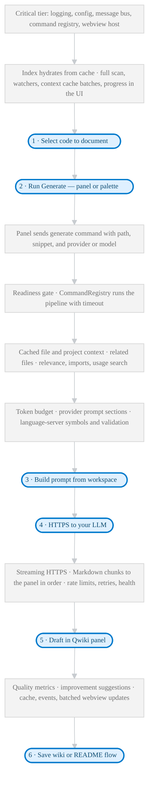

# Qwiki

<p align="center">
  
</p>

<p align="center">
QWIKI
<br />
Create Quick Wikis
</p>

<p align="center">
  
  
  
  
  
</p>


---

<p align="center">
  
</p>

Qwiki is a VS Code extension that stays local: you pick code, it drafts docs. It indexes the repo, picks sensible context for the LLM you configure, and shows everything in a small Vue panel so you rarely leave the editor.

### How it runs

You use a **side panel** in VS Code; the **extension** reads your files and calls the LLM. 

<div align="center">



</div>

**Read more**

- **Startup** — [Bootstrap responsiveness](./docs/ARCHITECTURE.md#bootstrap-responsiveness-architecture) · [Project indexing](./docs/SYSTEM_WORKFLOWS.md#project-indexing) · [Context cache warming](./docs/SYSTEM_WORKFLOWS.md#context-cache-warming) · [Service access points](./docs/ARCHITECTURE.md#service-access-points)

- **Steps 1–2** — [Wiki generation workflow](./docs/SYSTEM_WORKFLOWS.md#wiki-generation-workflow)

- **After Generate** — [Command initiation](./docs/SYSTEM_WORKFLOWS.md#command-initiation) · [Service readiness](./docs/SYSTEM_WORKFLOWS.md#service-readiness-system)

- **Context & prompt (before step 3)** — [Context building](./docs/SYSTEM_WORKFLOWS.md#context-building) · [Intelligent context selection](./docs/SYSTEM_WORKFLOWS.md#intelligent-context-selection) · [Prompt building](./docs/SYSTEM_WORKFLOWS.md#prompt-building)

- **Step 4 (LLM)** — [LLM request and streaming](./docs/SYSTEM_WORKFLOWS.md#llm-request-and-streaming)

- **Steps 5–6** — [Post-processing](./docs/SYSTEM_WORKFLOWS.md#post-processing) · [Completion](./docs/SYSTEM_WORKFLOWS.md#completion) · [Saving the wiki](./docs/SYSTEM_WORKFLOWS.md#saving-the-wiki) · [README automation](./docs/SYSTEM_WORKFLOWS.md#readme-automation-workflow)

- **Architecture patterns** — [Command pattern](./docs/ARCHITECTURE.md#1-command-pattern) · [Provider registry](./docs/ARCHITECTURE.md#3-provider-registry)


**First launch** can feel slower while indexing and cache warming catch up; later runs reuse more cached work.

**Privacy:** only the **HTTPS request to your LLM** (step 4) leaves your machine.

## Core Capabilities

- **Startup tiers** — critical services come up fast (under ~500ms); heavier work runs in the background with progress in the UI.
- **Project context** — indexes the workspace, scores related files, and stays within token limits when building a prompt.
- **Providers** — one integration path for several LLM backends (Google AI Studio, OpenRouter, Cohere, Hugging Face, Z.ai), with health checks, retries, and fallbacks.
- **Prompts** — templates and compression tuned per provider so output doesn’t drift format every run.
- **Quality pass** — uses language-server hints where it can, scores the draft, and suggests fixes before it lands in your wiki cache.
- **README flow** — can propose README edits from wikis, shows a diff, backs up the file, and writes when you approve.
- **Editor surfaces** — activity bar panel, saved wiki tree, hovers/completions, diagnostics, and commands wired through the same stack.

## Quick Start

```bash
git clone https://github.com/b-amir/qwiki.git
cd qwiki
pnpm run install:all
pnpm run build:webview
pnpm run compile
```

Launch the extension by pressing `F5` in VS Code. A development host opens with the Qwiki panel accessible from the activity bar. Configure an LLM provider in the panel settings before generating documentation.

## Everyday Workflow

1. Open a project in the extension development host.
2. Select the code you want documented or open a file.
3. Trigger **Qwiki: Generate a Quick Wiki!** from the command palette or the panel.
4. Review the generated documentation, save it to the wiki tree, or apply it to the README workflow.

## Project Layout

```text
src/
  application/          commands, services, transformers, validation, AppBootstrap
  domain/               entities and repository interfaces
  infrastructure/       repositories, logging, caching, indexing, background services
  llm/                  provider registry, manifests, prompts, capability types
  panels/               webview host, navigation, environment monitoring
  providers/            language feature providers (hover, completions, diagnostics)
  constants/            commands, events, limits, path patterns
  views/                saved wiki tree and related views

webview-ui/
  src/                  Vue application (App.vue, components, stores, composables, utilities)
  vite.config.ts        production build tuned for VS Code webviews
```

## Extended documentation
For deeper coverage, see the [docs](./docs) folder and the guides below:

- [Architecture](./docs/ARCHITECTURE.md) — layers, main services, how data moves around
- [API Reference](./docs/API_REFERENCE.md) — commands, messages, provider shapes
- [Developer Onboarding](./docs/DEVELOPER_ONBOARDING.md) — clone, build, debug, how we expect patches to look
- [Backend Guide](./docs/BACKEND.md) — extension host, wiring, VS Code gotchas
- [Frontend Guide](./docs/FRONTEND.md) — webview app, batching messages, perf notes
- [Design System](./docs/DESIGN_SYSTEM.md) — Tailwind + VS Code theme tokens, a11y
- [System Workflows](./docs/SYSTEM_WORKFLOWS.md) — what happens from activate through a wiki run
- [SOLID Principles](./docs/SOLID_PRINCIPLES.md) — how we use SOLID here (practical, not textbook)

---

Nothing leaves your machine except what you send to your chosen LLM API. The rest runs inside VS Code.
